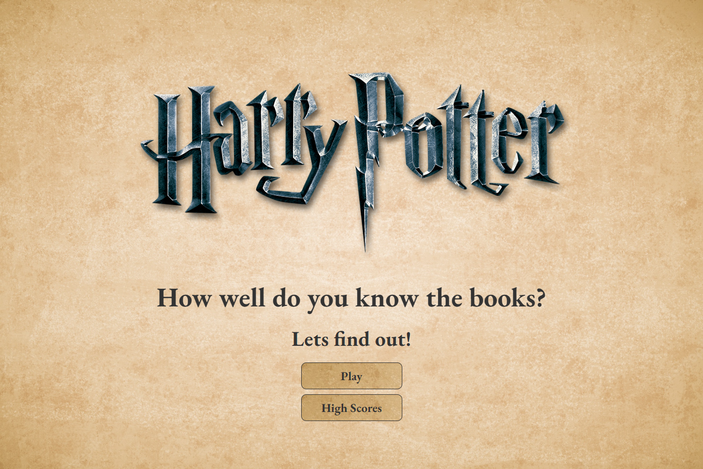
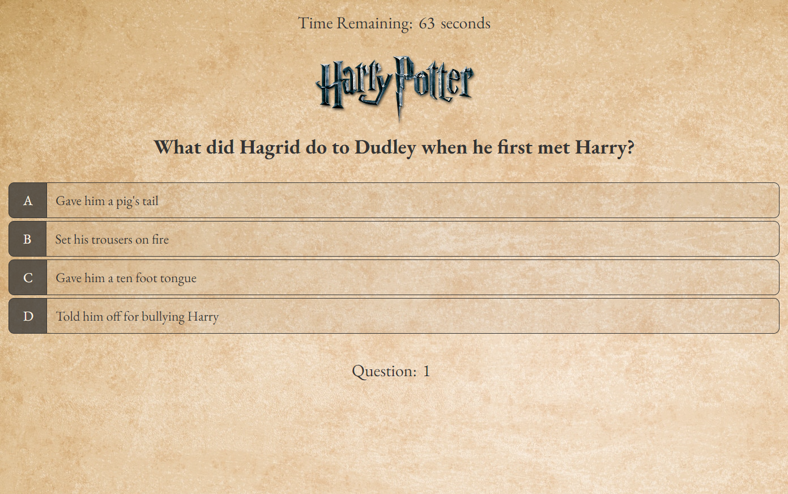
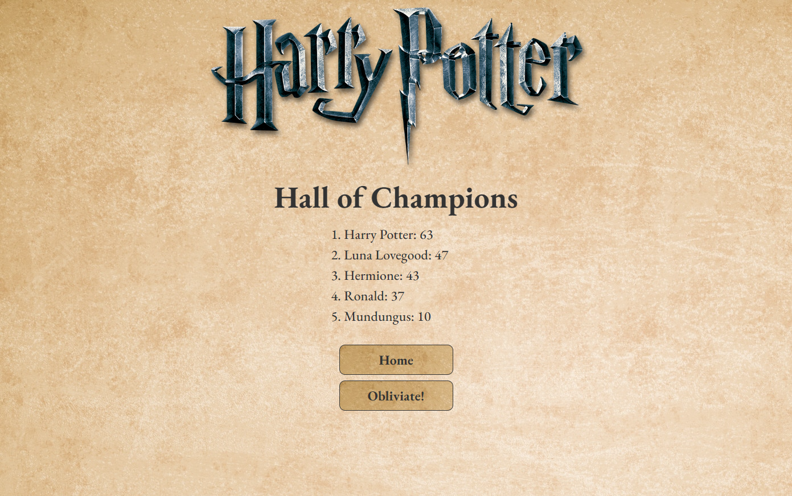

# 04 Web APIs: Code Quiz

## Background

This homework assignment required me to build a timed coding quiz with multiple-choice questions. The app runs in the browser and features dynamically updated HTML and CSS powered by JavaScript code that I have written. It has a clean, polished, and responsive user interface. 

**Note:** The instructor has said that our quiz questions don't need to be related to JavaScript.

Please see the repo at: https://github.com/DallasSybrowsky/JS-Quiz

The live page can be accessed at: https://dallassybrowsky.github.io/JS-Quiz/

## User Story

```
AS A coding boot camp student
I WANT to take a timed quiz on JavaScript fundamentals that stores high scores
SO THAT I can gauge my progress compared to my peers
```

## Acceptance Criteria

```
GIVEN I am taking a code quiz
WHEN I click the start button
THEN a timer starts and I am presented with a question
WHEN I answer a question
THEN I am presented with another question
WHEN I answer a question incorrectly
THEN time is subtracted from the clock
WHEN all questions are answered or the timer reaches 0
THEN the game is over
WHEN the game is over
THEN I can save my initials and my score
```

## Method

I created all elements of this quiz in relation to the HTML, CSS, and JavaScript. The questions supplied for the quiz, as specified by the instructor, can be on any topic I choose. As such I decided to make the quiz Harry Potter related. The questions for the quiz have been written by me and my family. Please enjoy testing your knowledge and good luck!

I built the code for this quiz from scratch and designed the script such that it would fit the criteria set forth above, and by the course instructor. There are three HTML pages. One is a welcome screen, one is the game itself, and the third is the high scores page.

Game Instructions:

When playing the game the player starts with 75 seconds. When a player answers a question they move to the following question. If their answer is correct they continue on without penalty. If their answer is incorrect they proceed, but with 15 seconds taken off the timer. There are 10 questions in the quiz. If the player reaches the end of the quiz they have an opportunity to enter their name or initials (whichever they prefer, but a blank response is not allowed) and their score is saved and displayed on the leaderboard. If either the timer runs out or the player gets too many incorrect answers and the timer runs out as a result of the penalties, the game is over and the player is presented with the opportunity to enter their name.

In the High Scores page (Hall of Champions) a list of high scores will appear. The game initially doesn't show any high scores if the game has not been played on the players computer. There is a button to take the player back to the Home page, as well as a second to erase the high scores (Obliviate!). There is text that shows up when the player hovers their cursor over the Obliviate button to inform those unfamiliar with Harry Potter Spells of the button's purpose.

Below are screenshots of the game's various pages:







## Support

If you need support or have questions about the page, please contact me at dallas.sybrowsky@gmail.com.